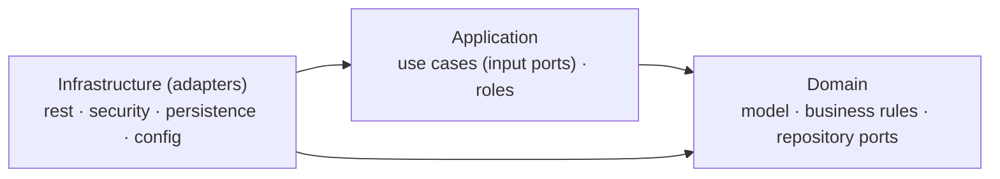

# Prices Service

REST API that returns the price that applies to a product of a brand at a given date and time.

A product can have several price lists whose date ranges overlap. When more than one is in force at the requested date, **the one with the highest priority wins**.

```http
GET /prices?date=2020-06-14T16:00:00&productId=35455&brandId=1
Authorization: Bearer <token>
```
```json
{
  "brandId": 1,
  "productId": 35455,
  "priceList": 2,
  "startDate": "2020-06-14T15:00:00",
  "endDate": "2020-06-14T18:30:00",
  "price": { "amount": 25.45, "currency": "EUR" }
}
```

The endpoint requires an access token, so a request without one returns `401 Unauthorized`. With the application [running](#getting-started), this logs in as the demo `user` and queries the price in one go, from a Bash shell:

```bash
TOKEN=$(curl -s -X POST http://localhost:8080/auth/login -H "Content-Type: application/json" \
        -d '{"username": "user", "password": "user"}' | sed -E 's/.*"accessToken":"([^"]+)".*/\1/')
curl "http://localhost:8080/prices?date=2020-06-14T16:00:00&productId=35455&brandId=1" \
     -H "Authorization: Bearer $TOKEN"
```

## Contents

- [Tech stack](#tech-stack)
- [Getting started](#getting-started)
- [Authentication](#authentication)
- [Architecture](#architecture)
- [Database](#database)
- [Testing](#testing)
- [Development workflow](#development-workflow)

## Tech stack

| Area | Technology |
|---|---|
| Language | Java 21 |
| Framework | Spring Boot 4.1 (Spring MVC, Spring Data JPA) |
| Security | Spring Security 7.1, OAuth2 resource server, JWT signed with RS256 |
| Persistence | H2 (in memory), Hibernate 7.4, Liquibase 5 |
| Mapping | MapStruct 1.6, Lombok |
| API docs | springdoc-openapi (Swagger UI) |
| Testing | JUnit 6, Mockito, AssertJ, Spring Security Test, ArchUnit 1.5 |

## Getting started

**Requirements:** JDK 21. Maven is not needed: the project includes the Maven wrapper.

```bash
./mvnw spring-boot:run
```

On Windows use `mvnw.cmd` instead of `./mvnw`. The API starts at `http://localhost:8080`, with the database created and loaded on startup.

Build and run all the tests:

```bash
./mvnw clean verify
```

Swagger UI: http://localhost:8080/swagger-ui/index.html

## Authentication

Every endpoint except the login requires a JWT access token, sent as `Authorization: Bearer <token>`.

### Demo users

| Username | Password | Role | `GET /prices` |
|---|---|---|---|
| `admin` | `admin` | `ADMIN` | ✅ Allowed |
| `user` | `user` | `USER` | ✅ Allowed |
| `guest` | `guest` | `GUEST` | ❌ 403 Forbidden |

Roles are hierarchical, **`ADMIN > USER > GUEST`**: each role can do everything the roles below it can. `GET /prices` requires `USER`, so `admin` and `user` can query prices and `guest` cannot.

These credentials are for local demo purposes only. Passwords are stored as BCrypt hashes.

### Getting and using a token

1. Log in to get a token, valid for 1 hour:

   ```bash
   curl -X POST http://localhost:8080/auth/login \
        -H "Content-Type: application/json" \
        -d '{"username": "user", "password": "user"}'
   ```
   ```json
   { "accessToken": "eyJraWQiOi...", "tokenType": "Bearer", "expiresIn": 3600 }
   ```

2. Send the token on every request:

   ```bash
   curl "http://localhost:8080/prices?date=2020-06-14T16:00:00&productId=35455&brandId=1" \
        -H "Authorization: Bearer <accessToken>"
   ```

To do both steps in one go, use the Bash snippet at the [top of this README](#prices-service).

### From Swagger UI

1. Open [Swagger UI](http://localhost:8080/swagger-ui/index.html). The documentation is public; only calling the endpoints requires a token.
2. In **Authentication → POST /auth/login**, click **Try it out** and **Execute**. The request body is already filled in with the `user` credentials.
3. Copy the `accessToken` from the response.
4. Click **Authorize** (top right), paste the token and confirm.
5. Call **Prices → GET /prices**. Swagger sends the token automatically.

## Architecture

The project follows the **onion architecture**, with the domain modelled following **DDD**. The business core is in the centre, and every dependency points inwards.

The split into `domain`, `application` and `infrastructure` layers comes from the onion architecture. The core talks to the outside through interfaces, the **ports**, implemented by **adapters** in `infrastructure`: that idea is shared with the hexagonal architecture, and the names of those classes reflect it.



`domain` and `application` form the core: plain Java, with no framework.

| Package | Ring | Contents |
|---|---|---|
| `domain.model` | Domain model | `Price`, value objects `Money`, `BrandId`, `ProductId` |
| `domain.service` | Domain services | `ApplicablePriceSelector`: the business rule, the highest priority wins |
| `domain.repository` | Domain services | `PriceRepositoryPort`: output port, what the domain needs from storage |
| `domain.exception` | Domain model | Domain errors, such as `NotFoundException` |
| `application.service` | Application services | `FindApplicablePriceUseCase` (input port) and `FindApplicablePriceService` (its implementation) |
| `application.security` | Application services | `Roles` constants |
| `infrastructure.rest` | Adapter | Controller, DTOs, error handling |
| `infrastructure.persistence` | Adapter | JPA entities, repositories, `PriceRepositoryAdapter`, `UserDetailsServiceAdapter` |
| `infrastructure.security` | Adapter | Security filter chain, login, JWT issuing and validation |
| `infrastructure.config` | Adapter | Bean wiring for the core, JPA auditing, OpenAPI |

### Adding a new use case

1. Create the input port `<Action>UseCase` in `application.service`.
2. Implement it in `<Action>Service`, in the same package. Keep it plain Java, with no Spring annotations.
3. Register the bean in `ApplicationConfig`, with the port as its return type.
4. If the use case needs new data, add the method to the output port in `domain.repository`, or create a new port there, and implement it in its adapter in `infrastructure.persistence`.
5. Inject the `<Action>UseCase` port in the controller.

### Architecture rules

The rules are enforced by [`ArchitectureTest`](src/test/java/com/technical/test/prices/ArchitectureTest.java) with ArchUnit, so the build fails if they are broken:

- Each ring may only depend on the rings inside it.
- Adapters may not depend on each other.
- `domain` and `application` may not depend on Spring or Jakarta.

## Database

H2 in memory. The schema and the demo data are created by Liquibase on every startup, so the data resets on each restart.

```
db/changelog/
├── db.changelog-master.xml
├── v1.0/  prices, brands and products tables, and the sample prices
└── v2.0/  users and roles tables, and the demo users
```

Sample prices, for brand `1` (BRAND_1) and product `35455`:

| Price list | From | To | Priority | Price |
|---|---|---|---|---|
| 1 | 2020-06-14 00:00 | 2020-12-31 23:59 | 0 | 35.50 EUR |
| 2 | 2020-06-14 15:00 | 2020-06-14 18:30 | 1 | 25.45 EUR |
| 3 | 2020-06-15 00:00 | 2020-06-15 11:00 | 1 | 30.50 EUR |
| 4 | 2020-06-15 16:00 | 2020-12-31 23:59 | 1 | 38.95 EUR |

The H2 web console is disabled.

## Testing

```bash
./mvnw clean verify
```

| Type | What it covers | Classes |
|---|---|---|
| Domain unit tests | Priority selection, `Money` validation | `ApplicablePriceSelectorTest`, `MoneyTest` |
| Application unit tests | Use case orchestration, with the repository mocked | `FindApplicablePriceServiceTest` |
| Security unit tests | Login flow, JWT issuing and reading, JWT configuration validation | `LoginServiceTest`, `TokenServiceTest`, `JwtPropertiesTest` |
| Infrastructure unit tests | Error handling, MapStruct mappers, loading users for the login | `GlobalExceptionHandlerTest`, `PriceEntityMapperTest`, `PriceResponseMapperTest`, `UserDetailsServiceAdapterTest` |
| Persistence tests | The price query against H2 with the Liquibase sample data, including the edges of the date range | `PriceRepositoryAdapterTest` |
| Integration tests | Full application, from HTTP to the database, with security enabled | `PriceControllerIntegrationTest`, `AuthControllerIntegrationTest` |
| Architecture tests | Onion dependency rules | `ArchitectureTest` |

The integration tests cover the five scenarios of the exercise, for product `35455` and brand `1`:

| # | Request date | Expected price list | Expected price |
|---|---|---|---|
| 1 | 2020-06-14 10:00 | 1 | 35.50 EUR |
| 2 | 2020-06-14 16:00 | 2 | 25.45 EUR |
| 3 | 2020-06-14 21:00 | 1 | 35.50 EUR |
| 4 | 2020-06-15 10:00 | 3 | 30.50 EUR |
| 5 | 2020-06-16 21:00 | 4 | 38.95 EUR |

They also check the edges of a price's date range, which are inclusive: at 2020-06-14 15:00:00 and 18:30:00 price list 2 applies, and one second outside that range price list 1 applies.

Finally, they cover the security flows end to end: logging in with each demo user, calling the API with the real token, and tampered, malformed or missing tokens.

## Development workflow

- **Branches:** Git Flow. `main` holds released versions, tagged as `vX.Y.Z`. `develop` collects finished work, and changes are made in branches named after the type of change (`feat/*`, `fix/*`, `refactor/*`, `test/*`), merged through pull requests.
- **Commits:** [Conventional Commits](https://www.conventionalcommits.org/) (`feat:`, `fix:`, `refactor:`, `docs:`...). A `!` marks a breaking change.
- **Versioning:** [Semantic Versioning](https://semver.org/). The latest release is **2.0.0**, a major version, because it broke the 1.x API: the price is now returned as a nested `price` object, and every request requires an access token.
